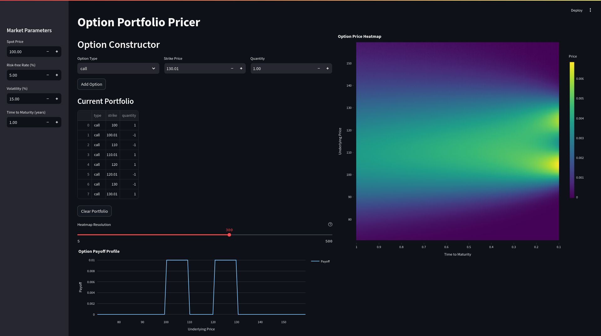

# OptionPortfolioPricer
Pricer for weighted sum of European vanilla options

## Overview
A web application for pricing and analyzing portfolios of European vanilla options. The tool allows users to:

- Construct option portfolios by combining calls and puts with different strikes and quantities
- Visualize the total portfolio payoff at expiration
- Explore the price surface across different spot prices and times to maturity
- Adjust market parameters like spot price, interest rate, and volatility

## Features
- Interactive GUI built with Streamlit
- Real-time portfolio payoff visualization using Plotly
- Price surface heatmaps showing portfolio value sensitivity
- Black-Scholes pricing model for vanilla options
- Ability to add multiple options and clear portfolio
- Individual option deletion with one click
- Market parameters in percentage format for intuitive input
- Compact single-line option constructor
- GPU-accelerated pricing calculations using PyTorch
- Parallel computation of option prices across the entire price-time grid
- High-performance vectorized operations for real-time surface updates

## Performance
The application leverages PyTorch's GPU acceleration capabilities to perform parallel computations:
- Vectorized Black-Scholes calculations across the entire price-time surface
- Automatic GPU utilization when available for maximum performance
- Efficient tensor operations for large option portfolios
- Real-time surface updates even with high-resolution grids (up to 1000x1000 points)

## Usage
The application provides an intuitive interface where you can:
1. Set market parameters in the sidebar
- Spot price with step of 1.0
- Risk-free rate in percent
- Volatility in percent
- Time to maturity in years
2. Add options to your portfolio using the option constructor
- Quick option creation with Type, Strike, and Quantity in one line
- Instant addition with "Add" button
3. View current portfolio composition
- Clear view of all options with their parameters
- Delete individual options with 🗑️ button
- Clear entire portfolio with one click
4. Analyze payoff diagram and price surface visualizations
5. Adjust heatmap resolution (higher values utilize GPU acceleration)
